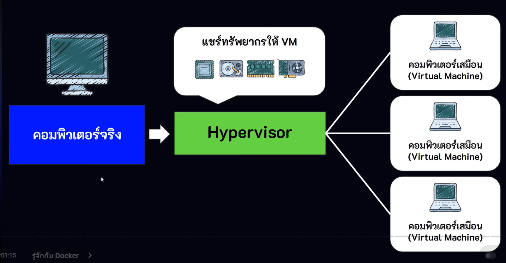
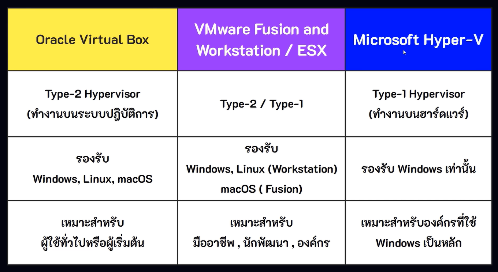

## Virtualized Deployment
เป็นยุคที่เกิดสิ่งที่เรียกว่า Software Hypervisor โดยมีแนวคิด คือ **การจำลองเครื่องคอมพิวเตอร์เสมือน (Virtual Machine หรือ VM)** มาไว้บนเครื่องคอมพิวเตอร์จริง (Physical Server) เพื่อรันหลายซอฟต์แวร์บนเครื่องเดียวกัน โดยทำการ **แยกสภาพแวดล้อมของแต่ละซอฟต์แวรออกจากกันอย่างอิสระ ทำให้การจัดการแอพพลิเคชันทำได้ง่ายและปลอดภัยกว่าแบบ traditional deployment**

### Virtual Machine (VM)
เป็นการจำลองคอมพิวเตอร์ขึ้นมาทำงานบนเครื่องจริง (Host Machine) เพื่อให้เราสามารถรันระบบปฏิบัติการและซอฟต์แวร์ได้หลายตัวบนเครื่องเดียวกัน

*Host Machine เป็นเครื่องจริงที่ติดตั้งระบบปฏิบัติการหลักเพื่อนำมารัน VM* 

โดย VM จะทำงานอยู่บน Host OS และดึงทรัพยากรณ์จากเครื่องจริงมาใช้งาน เช่น CPU, RAM, DISK, NETWORK และแต่ละ VM จะทำงานแยกอิสระออกจากกัน

คำอธิบายโครงสร้าง
- **Hardware** เป็นโครงสร้างพื้นฐาน (infrastructure) หรือ เครื่องคอมพิวเตอร์จริงสำหรับนำมาใช้รันโปรแกรม เช่น CPU, RAM, DISK
- **Host OS** ระบบปฏิบัติการที่จะทำให้ hardware และ software ต่าง ๆ สามารถทำงานร่วมกันได้
- **Hypervisor** ซอฟแวร์ตัวกลางที่ทำหน้าที่จัดการและควบคุมการทำงานของ virtual machines โดยจะคอยจัดสรรทรัพยากรณ์ให้กับ vm
- **Virtual Machine** เครื่องเสมือนที่ถูกควบคุมโดย Hypervisor โดย 1 vm = คอมพิวเตอร์ 1 เครื่อง

### Hypervisor
- แบ่งปันทรัพยากร เช่น CPU, RAM, DISK จากเครื่องจริง ไปให้ virtual machine แต่ละเครื่อง
- รัน guest os หลายตัวพร้อมกัน
- ควบคุมความปลอดภัยและการทำงานอิสระแยกกันของ vm แต่ละเครื่อง

โดย hypervisor จะถูกแบ่งออกเป็น 2 ประเภท คือ
1. Bare-Metal Hypervisor (Type-1)
2. Hosted Hypervisor (Type-2)

### Bare-Metal Hypervisor (Type-1)
คือ hypervisor ที่ติดตั้งและทำงานบนฮาร์ดแวร์โดยตรง เช่น VMware ESX, Microsoft Hyper-V เหมาะสำหรับระบบขนาดใหญ่ เช่น Data Center, Enterprice Server

### Hosted Hypervisor (Type-2)
คือ hypervisor ที่ติดตั้งและทำงานบนระบบปฏิบัติการ (OS) เช่น VMware Workstation, Oracle Virtual Box เหมาะสำหรับการใช้งานทั่วไป เช่น พัณนาและทดสอบโปรแกรม, การรันโปรแกรมเก่า, Sandbox Environment เป็นตัน

**ตัวอย่างรายชื่อ VM ยอดนิยมในปัจจุบัน**

### ส่วนประกอบของ virtual machine
1. **Guest OS** ระบบปฏิบัติการที่ใช้บน virtual machine เช่น windows, linux
2. **Binaries/Libraries** ชุดคำสั่งหรือไฟล์สำหรับรันซอฟต์แวร์
3. **Application** ซอฟต์แวร์ที่เราจำเป็นต้องใช้ในการทำงานของระบบเรา เช่น Web Server, Database

### ตัวอย่างการใช้งาน virtual machine
- ใช้เพื่อทดลอลซอฟต์แวร์หรือระบบปฏิบัติการเวอร์ชันใหม่ โดยไม่ให้ส่งผลกระทบกับเครื่องจริง
- ใช้เพื่อวิจัยความปลอดภัย สามารถเปิดไฟล์ที่่น่าสงสัยบน VM ได้ โดยไม่ให้เครื่องจริงได้รับผลกระทบ
- ใช้รับซอฟต์แวร์เก่าที่รันระบบที่เข้ากับ OS ใหม่ไม่ได้ เช่น ซอฟต์แวร์รุ่นเก่าที่รันได้เฉพาะใน Windows XP/7

### ข้อดี
- ใช้งานได้หลายระบบปฏิบัติการบนเครื่องเดียวกัน
- แยกสภาพแวดล้อมได้ เช่น Development / Testing / Production
- มีความปลอดภัย เนื่องจาก vm แต่ละเครื่องจะแยกอิสระออกจากกัน
- สำรอง/กู้คืนได้ง่าย

### ข้อเสีย
- ใช้ทรัพยากรณ์เยอะ เนื่องจาก vm แต่ละเครื่องใช้ ram, cpu, disk แยกเป็นของตัวเอง
- ทำงานช้ากว่าเครื่องจริง เนื่องจาก hypervisor และ guest os ทำให้การ boot os ใน vm แต่ละเครื่องใช้เวลานานมาก
- มีความซับซ้อนในการบริหารจัดการ VM หลายเครื่อง เช่น อัพเดท OS, patch ความปลอดภัย, backup
- มีค่าใช้จ่ายสูง เนื่องจากต้องใช้เครื่องที่แรกมากพอจึงจะรองรับการทำงานได้หลาย VM และต้องคำนึงถึง license ต่าง ๆ ของแต่ละ os ที่จะทำมาใช้งานใน vm แต่ละเครื่อง