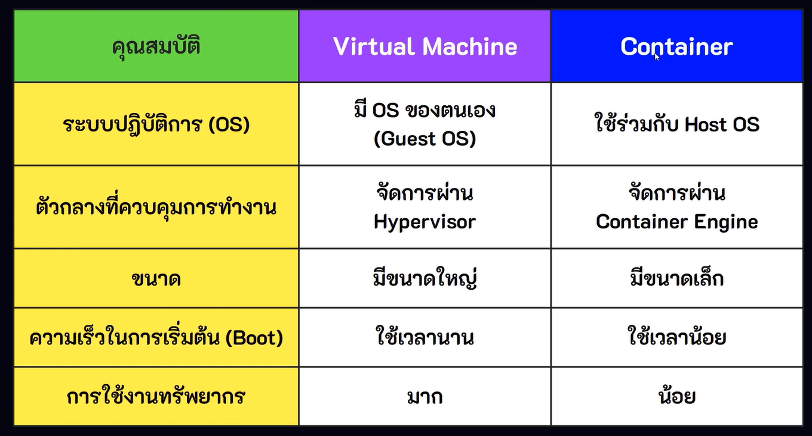
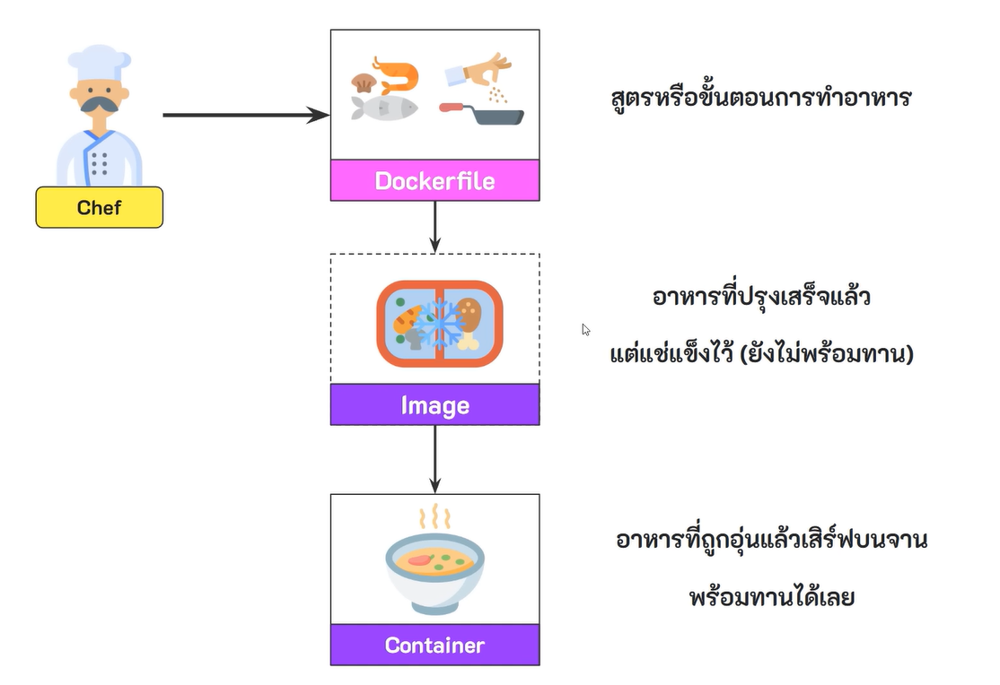
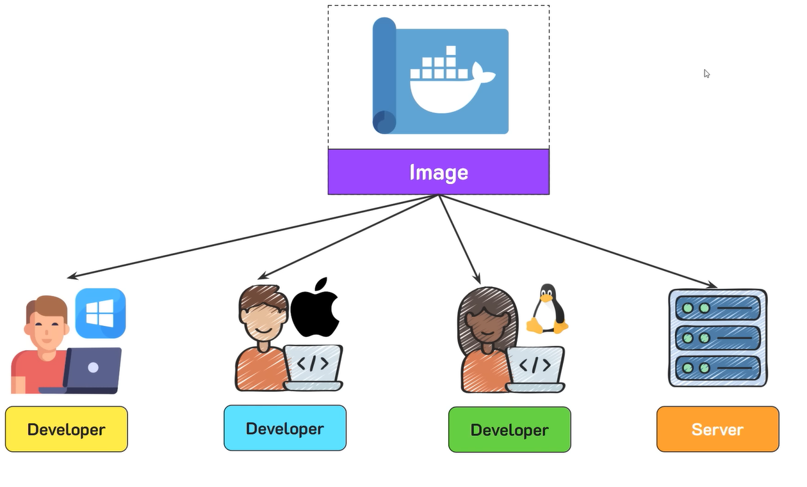
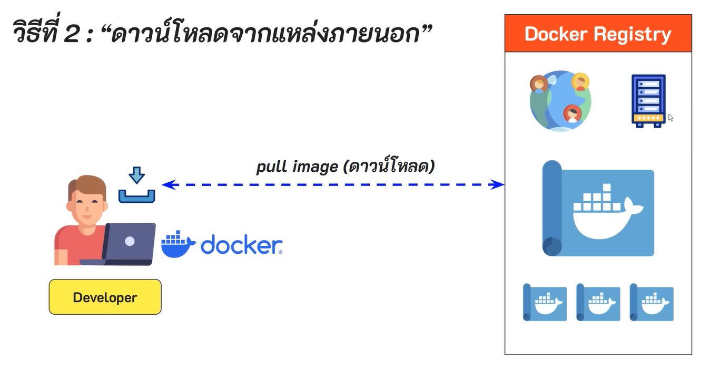

## Container Deployment
เป็นการทำแนวคิดของ virtualized deployment มาต่อยอด โดยเปลี่ยนจาก virtual machine มาเป็น container

### Containerization
คือ การรวบรวมแอพพลิเคชันและทรัพยากรที่เกี่ยวของกับการทำงานของแอพ (Code, Library, Config, อื่น ๆ) มาแพ็ครวมกันและเก็บไว้ในสิ่งที่เรียกว่า container เพื่อให้สามารถนำแอพพลิเคชันไปใช้งานที่ไหนก็ได้ โดยไม่ต้องกังวลเรื่องสภาพแวดล้อมที่แตกต่างกัน (ไม่สนใจว่าเครื่องนั้นใช้ OS อะไรหรือติดตั้งอะไรไว้)

สถาปัตยกรรมของ container deployment

*เหมือนกับ vm แต่เปลี่ยนจาก hypervisor มาเป็น container engine*
ส่วนประกอบในสถาปัตยกรรม
- **Hardware** เป็นโครงสร้างพื้นฐาน (infrastructure) หรือ เครื่องคอมพิวเตอร์จริงสำหรับนำมาใช้รันโปรแกรม เช่น CPU, RAM, DISK
- **Host OS (Host Operating System)** ระบบปฏิบัติการที่จะทำให้ hardware และ software ต่าง ๆ สามารถทำงานร่วมกันได้ เช่น Windows, Linux
- **Container Engine** หรืออีกชื่อ คือ Container Runtime เป็นซอฟต์แวร์ที่ทำหน้าที่จัดการและควบคุมการทำงานของ container
- **Container** กล่องที่บรรจุแอพพลิเคชันและทุกอย่างที่จำเป็นในการทำงานของแอพมาไว้ในที่เดียว เช่น
    - ชุดคำสั่งของโปรแกรม (source code)
    - Runtime Environment
    - การตั้งค่า (Configuration)
    - Libraries & Dependencies (ชุดคำสั่งหรือไฟล์สำหรับใช้ในการรับโปรแกรม)

ตัวอย่าง container engine ยอดนิยม
- docker engine
- containerd
- cri-o
- podman

*Container ตัด guest os ออกเพราะมันทำให้ระบบของเรารันช้า*

แต่ละ container จะใช้ระบบปฏิบัติการเดียวกัน ทำให้ขนาดของ container เล็ก และทำงานได้เร็วกว่าแบบ virtual machine

แต่ละ container จะทำงานแยกจากกนแบบอิสระ ทำให้เราสามารถจัดการหรือปรับแต่ง container แต่ละอันได้โดยไม่สงผลกระทบกับ container อื่น ๆ และทำให้บนเครื่องคอมพิวเตอร์เดียวกัน สามารถรันซอฟต์แวร์หลายตัวแม้วานซอฟต์แวร์แต่ละตัวจะมีเวอร์ชันของไลบรารี่ที่แตกต่างกันก็ตาม

*ส่วนใหญ่จะใช้ linux กัน*

ตารางเปรียบเทียบ virtual machine กับ container
'

### Docker
เป็นแพลดฟอร์มที่ครอบคลุมทั้งระบบ containerization โดยมีเครื่องมืออำนวยความสะดวกและบริการต่าง ๆ เช่น 
- Docker CLI
- Docker Engine
- Docker Compose
- Docker Desktop
- Docker Registry
โดยถูกใช้เพื่อให้นักพัฒนาสามารถ develop & deploy และรันแอพพลิเคชันบน container ได้

### docker engine
เป็นชุดเครื่องมือสำหรับใช้ในการจัดการ container (runtime) ประกอบด้วย docker cli, docker api, docker deamon (dockerd)

### docker cli (Command Line Interface)
เครื่องมือสำหรับสั่งงาน docker engine ผ่านการพิมพ์คำสั่งบน console เช่น docker run, docker build

### docker compose 
เป็นเครื่องมือเอาไว้จัดการหลาย ๆ container ที่เกี่ยวข้องกัน

### docker registry
เป็นคลังส่วนกลาง ใช้เก็บ images เพื่อให้นักพัฒนาทั่วโลกสามารถสร้างและแชร์ images ให้นักพัฒนาคนอื่นสารถนำไปใช้ได้

### docker desktop
เป็น GUI Application ที่มี docker cli และ docker engine ทำงานอยู่ข้างใน

แผนผัง docker plateform

*ขยายระบบง่ายและเร็ว*

### สภาพแวดล้อมในบริบทของการพัฒนาซอฟต์แวร์
หมายถึง ทุกสิ่งที่จำเป็นเพื่อให้ซอฟต์แวร์สามารถทำงานได้อย่างถูกต้อง ประกอบด้วย
- ระบบปฏิบัติการ เช่น windows, linux
- สิ่งที่่ใช้สำหรับรันชุดคำสั่ง (runtime environment) เช่น python, nodejs
- ไลบรารี่และแพ็คเกจที่เกี่ยวข้อง
- การตั้งค่าต่าง ๆ เช่น environment variable
- ฐานข้อมูลและบริการอื่น ๆ ที่โปรแกรมต้องเชื่อมต่อด้วย

### ขึ้นตอนที่นักพัฒนาควรทำ

1. สร้าง dockerfile ขึ้นมาก่อน เพื่อทำการระบุว่าโปรแกรมของเราจะต้องการอะไรบ้าง
2. นำ dockerfile มาสร้างเป็น image ด้วยคำสั่ง **docker build** โดย image จะเป็นสิ่งที่ทุกคนนำไปใช้
3. นำ image ที่ได้มา มาสร้างเป็น container โดยเราสามารถสั่งให้ docker นำ image มาสร้างเป็น container บนเครื่องของเราได้ด้วยคำสั่ง **docker run**

### image
เป็นไฟล์สำเร็จรูป สำหรับนำไปสร้างเป้น container โดยที่ด้านในจะประกอบไปด้วยชุดคำสั่งและการตั้งค่าที่จำเป็นสำหรับโปรแกรม

*image 1 ชุด สามารถนำมาสร้าง container ได้หลายก้อน*

### container 
เป็นการรันโปรแกรมขึ้นมา โดยใช้ทรัพยากรณ์ที่ได้รับมาจาก image

### เปรียบเทียบการทำงานของ docker กับอาชีพเชฟ

### ทุกสิ่งที่เราต้องค่าใว่ใน image ทุกคนจะได้เหมือนกัน

### การจัดหา image มาใช้
- สร้าง image ขึ้นมาเอง โดยอาศัพ dockerfile (custom image)
- ดาวน์โหลดจากแหล่งภายนอก สามารถดาวน์โหลด image สำเร็จรูปพร้อมใช้งานได้จาก docker registry (docker hub) ซึ่งเป็นแหล่งรวม images ต่าง ๆ ที่่นักพัฒนาทั่วโลกได้สร้างไว้

### ข้อดีของ docker
- ช่วยให้นักพัฒนาสามารถ develop, deploy โปรแกรมได้ง่าย เพราะทุกอย่างอยู่ใน container
- ลดปัญหาความเข้ากันไม่ได้ของไลบรารี่ เช่น เวอร์ชันของไลบรารี่ หรือ การติดตั้ง dependency เอง เนื่องจากนักพัฒนาทุกคนใช้สภาพแวดล้อมเดียวกัน
- สามารถพัฒนาในเครื่องหนึ่ง แล้วนำไปรันบนเซิร์ฟเวอร์หรือเครื่องอื่นได้ทันที โดยไม่ต้องกังวลเรื่องความแตกต่างของสภาพแวดล้อม
- ใช้ทรัพพยากรณ์น้อยกว่า vm และใช้ได้หลายแพลตฟอร์ม เช่น windows, macOS, linux และคลาวด์ต่าง ๆ
- รองรับ auto scaling สามารถเพิ่ม - ลด จำนวน container ได้ตามความต้องการ ทำให้องค์กรสามารถควบคุมค่าใช้จ่ายได้เหมาะสม
-  รองรับ microservice atchitecture สามารถแยกรันแอพพลิเคชันออกเป็นหลาย ๆ container ได้ เพื่อให้ง่ายต่อการพัฒนาและการดูแลระบบ