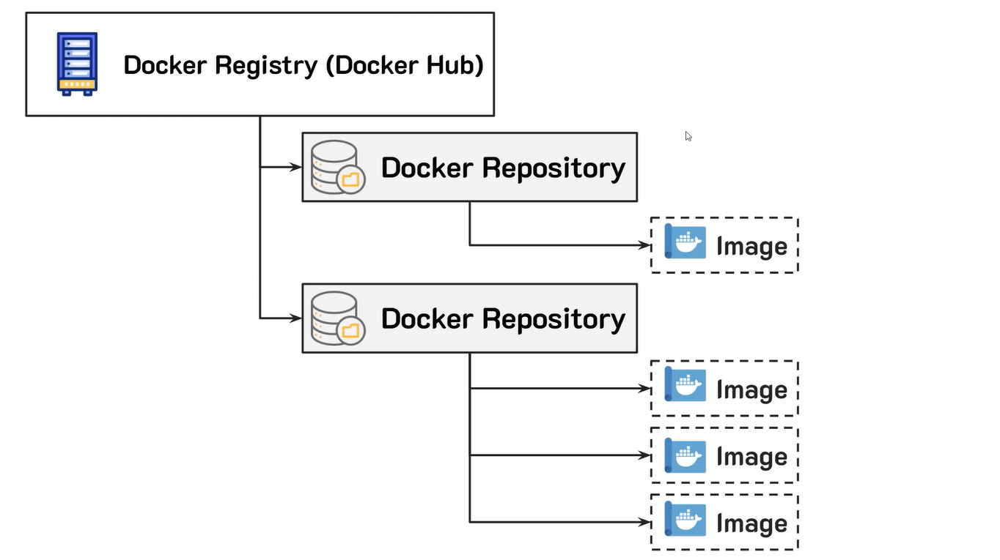

## Docker Registry

### registry
เป็นคลังส่วนกลางที่ใช้เก็บ images โดยนักพัฒนาทั่วโลกสามารถสร้างและแชร์ images ให้กับนักพัฒนาคนอื่น ๆ ได้อย่างสะดวก เช่น docker hub, azure container registry, google container registry เป็นต้น โดย docker hub คือ public registry ที่ได้รับความนิยมมากที่สุด

### image
คือไฟล์สำหรับนำไปสร้างเป็น container ซึ่งด้านในบรรจุโค้ดและการตั้งค่าที่จำเป็นในการรันแอพพลิเคชัน

### ประเภทของ image ใน docker hub
- **official image** เป็น image ที่ถูกสร้างและดูแลโดยทีมงาน docker ทำให้มั่นใจได้ว่าปลอดภัย เช่น nginx, node, python
- **user image (public image)** เป็น image ที่ถูกสร้างและอัปโหลดโดยผู้ใช้งานทั่วไปหรือองค์กร การนำมาใช้งานต้องคำนึงถึงความปลอดภัย
- **user image (private image)** เป็น image ส่วนตัวที่ไม่อนญาติให้ผู้อื่นนำไปใช้ โดยปกติจะเป้นงานในองค์กรหรือโปรเจคส่วนตัว
- **verify publisher images** เป็น image ที่ถูกสร้างจากบริษัทหรือองค์กรที่มีความหน้าเชื่อถือ เช่น google/cloud-sdk
- **sponsored OSS** เป็น image โปรเจคค์ open source ที่ได้รับการสนับสนุนจาก docker เช่น jenkins/kenkins, selenium/node-firefox

### Repository
หมายถึง คลังย่อยที่ทำหน้าที่จัดเก้บกลุ่มของ images ที่มีชื่อเดี่ยวกันแต่มีเวอร์ชันต่างกันโดยหนึ่ง repository อาจมีหลาย image ที่แตกต่างกันที่เลขเวอร์ชัน (tag) เช่น :latest, :v1, :v2

*เปรียบเสมือน folder ที่จัดเก็บ image นี้แบบทุก version เอาไว้*
