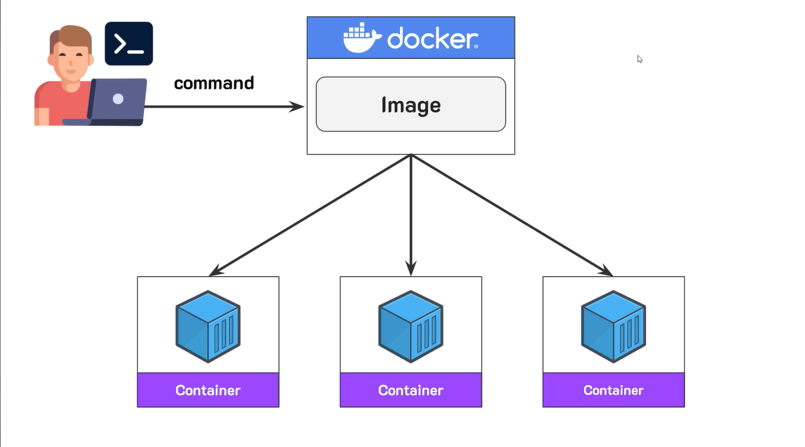

## Docker Image

*บางกรณีจะเป็นการโหลดตัว runtime ลงมา เช่น node นำมารัน javascript*

## คำสั่งจัดการ images

### docker images
    แสดง images ที่มีอยู่ทั้งหมดบนเครื่องเรา

### docker pull (image-name)
    โหลด image เวอร์ชันล่าสุด (latest) จาก docker hub

### docker pull (image-name):(tag)
    โหลด image ตาม version (tag) ที่ระบุ

### docker inspect (image-name)
    ดูรายละเอียดของ image

### docker rmi (image-id)
    ลบ image ตาม id ที่ระบุ 

### docker rmi (image-name):(tag)
    ลบ image ตามชื่อและ tag
    เช่น docker rmi python:3.9

### docker image prune
    ลบ image ที่ไม่ได้ใช้งานออก