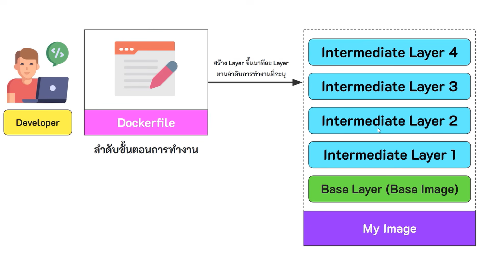
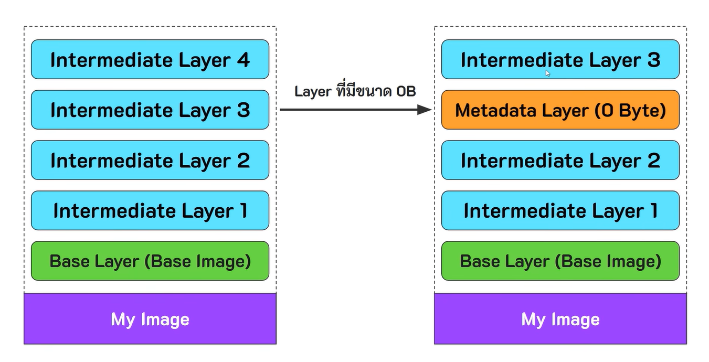
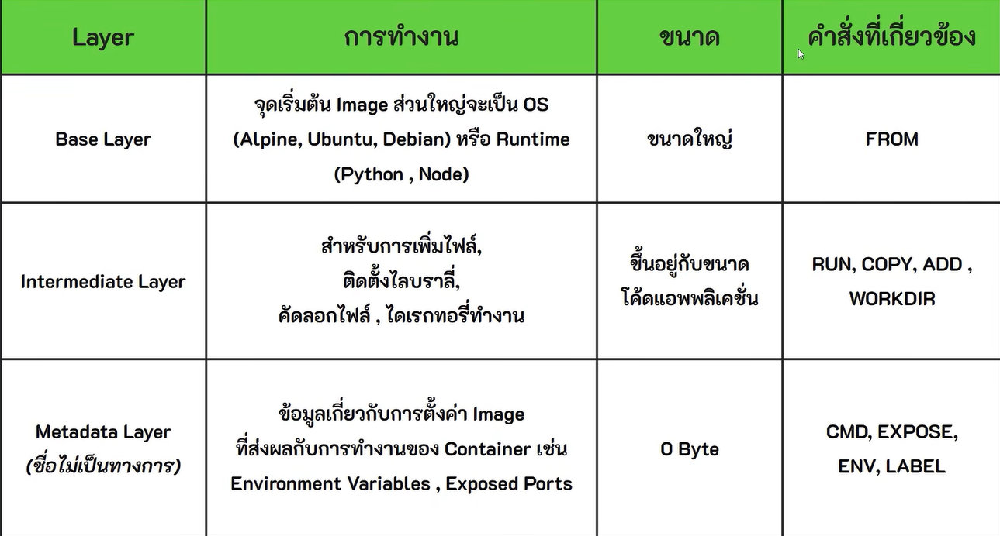
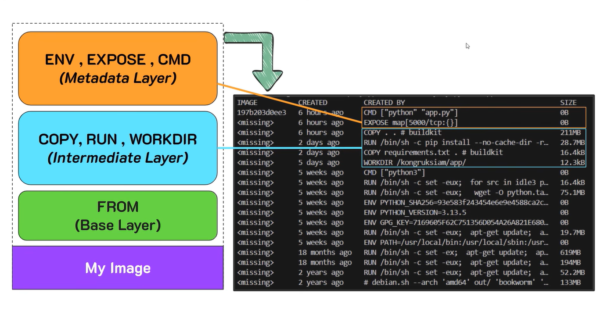
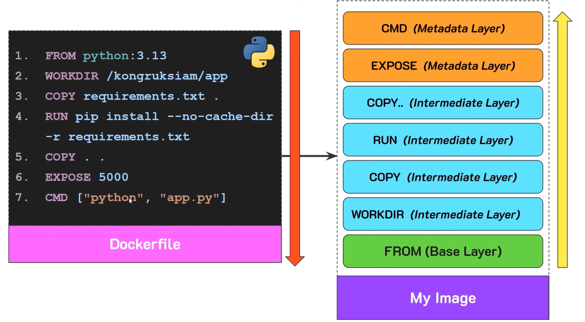
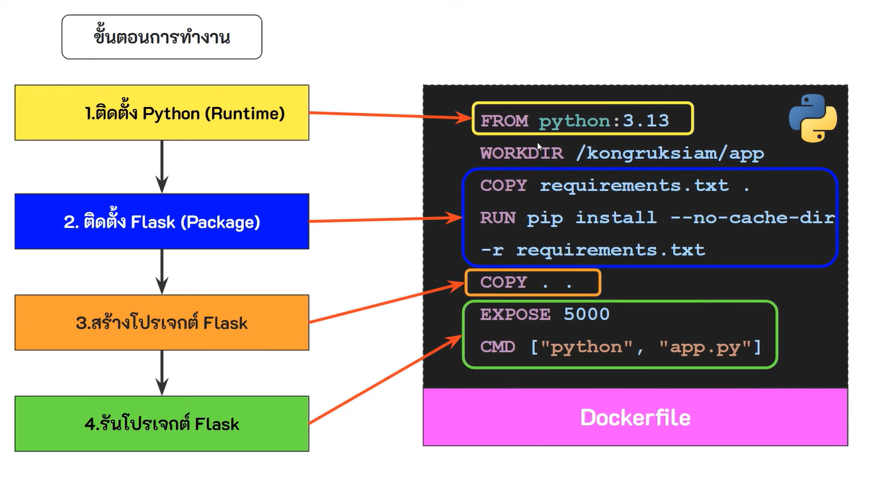
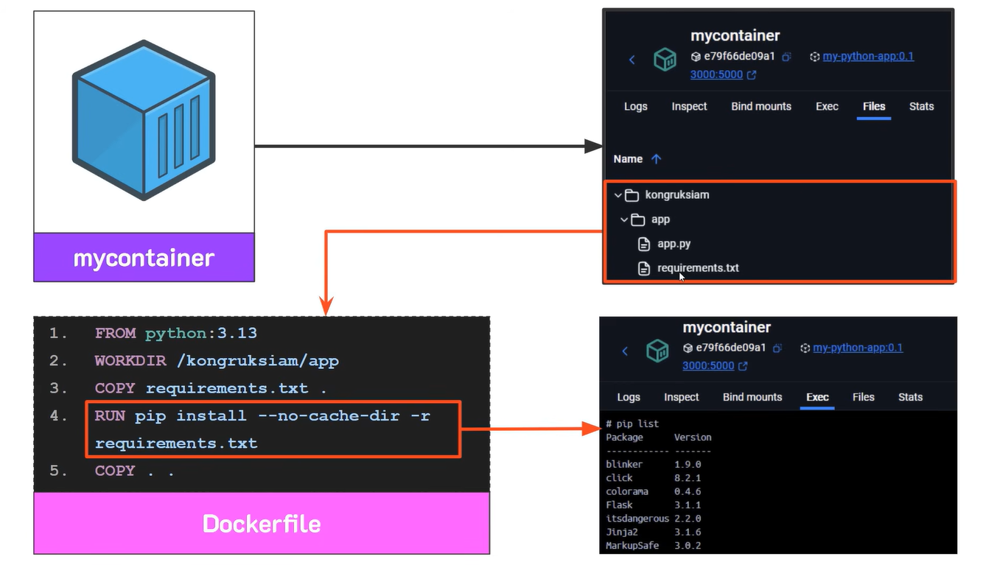

## dockerfile
เป็นไฟล์ที่เอาไว้ระบุขั้นตอนในการสร้าง image ที่่เราต้องการ
โดยใน image จะต้องมีทุกอย่างที่จำเป็นในการรันโปรแกรม

*ระบุขั้นตอนการเตรียมสภาพแวดล้อมที่โปรแกรมเราจำเป็นต้องใช้ไว้ใน dockerfile ก่อนจะนำไปสร้าง image (custom image)*

### ขั้นตอน
1. นักพัฒนาสร้าง dockerfile สำหรับกำหนดขั้นตอนในการสร้าง image ขึ้นมาใช้งาน เช่น การติดตั้งไลบรารี่ การตั้งค่าแอพพลิเตชัน
2. นักพัฒนาสร้าง image จาก dockerfile โดยใช้คำสั่ง docker build จะทำให้ได้ไฟล์ image มาใช้งาน ซึ่งภายในไฟล์ดังกล่าวจะบรรจุชุดคำสั่งของแอพพลิเคชันรวมถึงทุกสิ่งที่จำเป็นสำหรับแอพ

### layers
เป็นสิ่งที่อยู่ด้านใน image โดยมันใช้เรียกแทนขั้นตอนการทำงานของ image
โดย layer ถูกแบ่งออกดังนี้

รายละเอียดโครงสร้าง
- **base layer** เป็นฐานของ image โดยจะมาจากการนำ image อื่นมาต่อยอดเพื่อสร้าง image ใหม่ โดยในชั้นนี้ส่วนใหญ่จะเป็น OS (Alpine, Ubuntu, Debian) หรือ runtime time (python, node)
- **intermediate layer** ชั้นที่ถูกสร้างต่อจาก base layer โดยในชั้นนี้จะใช้สำหรับ เพิ่มไฟล์, ติดตั้งไลบราลี่, คัดลอกไฟล์ โดยมีคำสั่งที่เกี่ยวข้อง เช่น RUN, COPY, ADD, WORKDIR

- **metadata layer** เป็น layer เสริม ใช้เก็บข้อมูลเกี่ยวกับการตั้งค่า image ที่ส่งผลกระทบต่อการทำงานของ container เช่น ตัวแปรสภาพแวดล้อม, การตั้งค่า port ที่จะเปิดใช้งาน โดยคำสั่งประกอบด้วย CMD, EXPOSE, ENV, LABEL โดยคำสั่งเหล้า่นี้ไม่ได้เปลี่ยนแปลง file system โดยตรง ทำให้่ขนาดของ layer = 0 byte

### ตารางสรุปแต่ละ layer

### ตัวอย่างแต่ละ layer

## คำสั่งเกี่ยวกับ dockerfile

### FROM (image)
    เป็นการกำหนด base image ต้องอยู่บันทัดแรกเสมอ เช่น
    ถ้าเราต้องการ image ของ python เวอร์ชัน 3.13 สามารถพิมพ์ได้ดังนี้
    
    FROM python:3.13 

### WORKING (path)
    กำหนดโฟลเดอร์ทำงานของ container เช่น

    WORKDIR bright/app

    ทุกคำสั่งที่เกี่ยวกับ path หลังจากนี้ เช่น COPY, RUM, CMD จะอ้างอิงโฟลเดอร์นี้เป็นหลัก

### COPY (host-path) (container-path)
    คัดลอกไฟล์จากเครื่องเรา (local) ไปยัง container เช่น

    COPY app.py /bright/app/

    คัดลองไฟล์ app.py ไปยังโฟลเดอร์ /bright/app/

### RUN (command)
    ติดตั้ง dependencies ลง container เช่น

    RUN npm install

### EXPOSE (port-number)
    กำหนดหมายเลข port ที่จะเปิดใช้ใน container เช่น
    EXPOSE 8080

### CMD ["(command), "(arg1)"]
    ชุดคำสั่งที่จะถูกเรียกใช้งานในตอนเริ่มต้น เมื่อมีการรัน container เช่น

    CMD["python", "app.py"]
    CMD["node", "app.js"]

## ตัวอย่างคำสั่ง 
    FROM python:3.13
    WORKDIR /bright/app
    COPY requriements.txt .
    RUN pip install --no-cache-dir-r requirements.txt
    COPY . .
    EXPOSE 5000
    CMD ["python", "app.py"]

### คำอธิบาย
1. กำหนด base image ที่ต้องการใช้งาน
2. สร้างโฟลเดอร์ใน container สำหรับเก็บไฟล์
3. คัดลอกไฟล์ requirements.txt เข้าไปที่ container
4. ติดตั้ง package ด้วย pip (package manager)
5. คัดลอกไฟล์ทั้งหมดจาก host เข้าไปที่ container
6. ระบุ port ที่่จะใช้ใน container
7. กำหนดคำสั่งเริ่มต้นเมื่อรัน container

*requirements.txt เป็นไฟล์รวบรวม dependency ที่จะต้องใช้ของภาษา python*

### เปรียบเทียบคำสั่งกับ layer

### ขั้นตอนการทำงาน

โดยเมื่อเราสร้าง dockerfile เรียบร้อยแล้ว เราสามารถใช้คำสั่ง **docker build -t (image-name) (ที่อยู่ dockerfile)** เพื่อสร้าง image ได้

หรีือใช้คำสั่ง **docker build -t (image-name):(tag) (ที่อยู่ dockerfile)** เพื่อระบุ version

*COPY requirements.txt . หมายถึง ให้คัดลัก requirements.txt ไปยังโฟลเดอร์ปัจจุบันที่อยู่ใน container (อิงจาก workdir)*

*requirements.txt . มีค่าเท่ากับ requirements.txt /bright/app*

*COPY . . หมายถึง คัดลอกทุกอย่างในโฟลเดอร์ทำงานบนเครื่องของเรา ไปใส่โฟลเดอร์บน container ตาม path workdir*