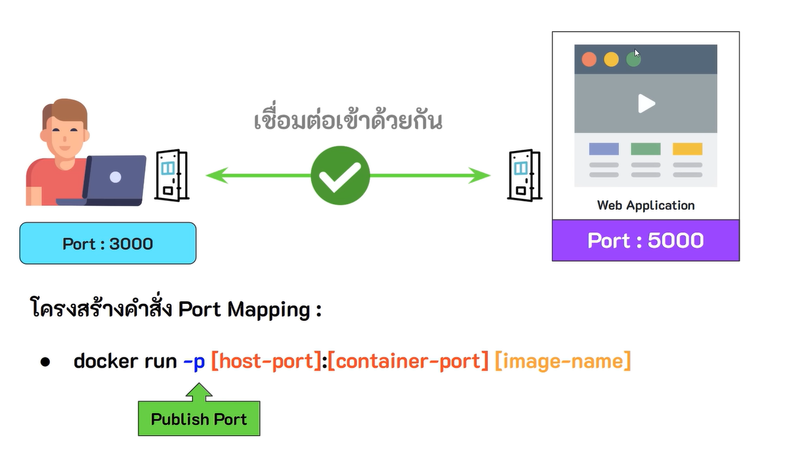

## Port Mapping
การที่เราจะสามารถเข้าถึงซอฟต์แวร์ที่อยู่ใน container ได้นั้น เราจำเป็นต้องใช้ port mapping

โดยมีคือ การกำหนดช่องทางให้เครื่อง host ที่อยู่ภายนอด สามารเชื่อมต่อเข้าไปยัง container ได้ เพื่อเข้าถึงซอฟต์แวร์ที่ทำงานอยู่ใน container ผ่านหมายเลข port ที่กำหนด

**โดยประกอบไปด้วย 2 ส่วน คือ**
1. **Host Port** หมายถึง หมายเลข port บนเครื่อง host ที่จะใช้เชื่อมต่อเข้าไปยัง container
2. **Container Port** หมายถึง หมายเลข port ใน container สำหรับสื่อสานกับ container อื่นที่อยู่ใน network เดียวกันหรือเชื่อมต่อกับโลกภายนอ (เครื่อง host) ผ่าน port mapping

โดยเราสามารถเชื่อมต่อ host port กับ container port เข้าด้วยกันได้ผ่านคำสั่ง **docker run -p [host-port]:[container-port] [image-name]**

***ตัวอย่าง** docker run --name python-box-2 -p 3000:5000 my-python-container:0.0.1*