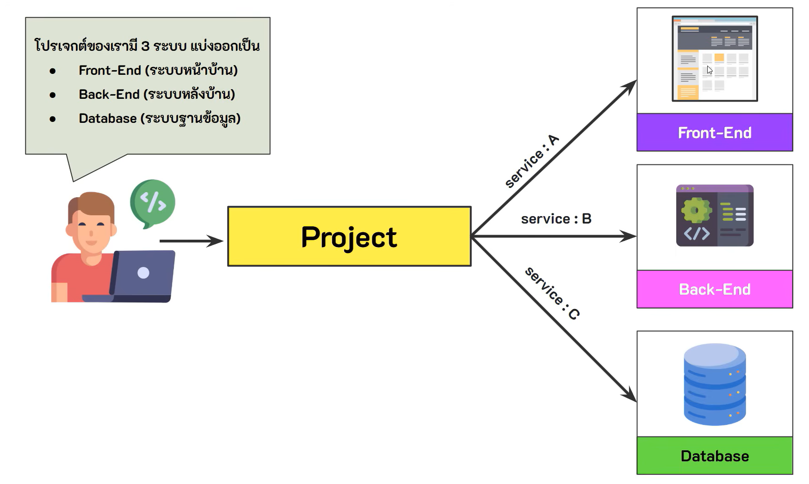
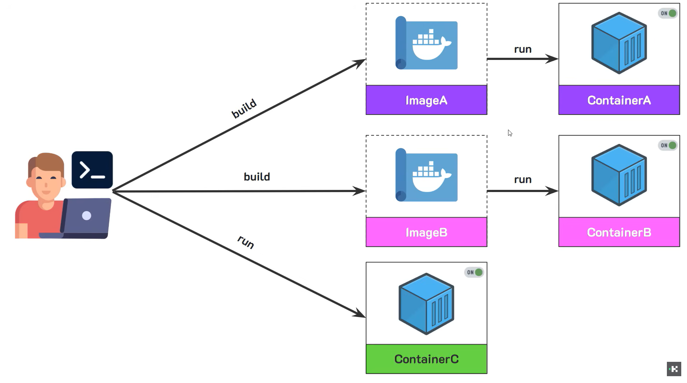
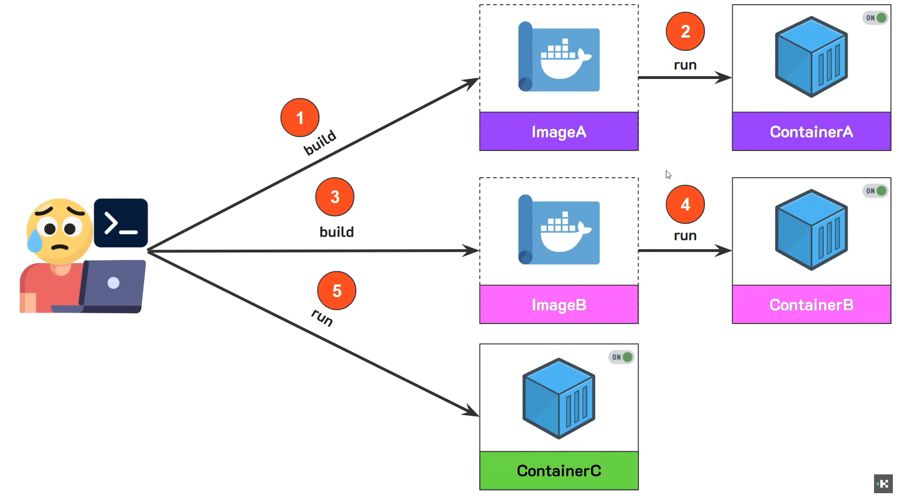
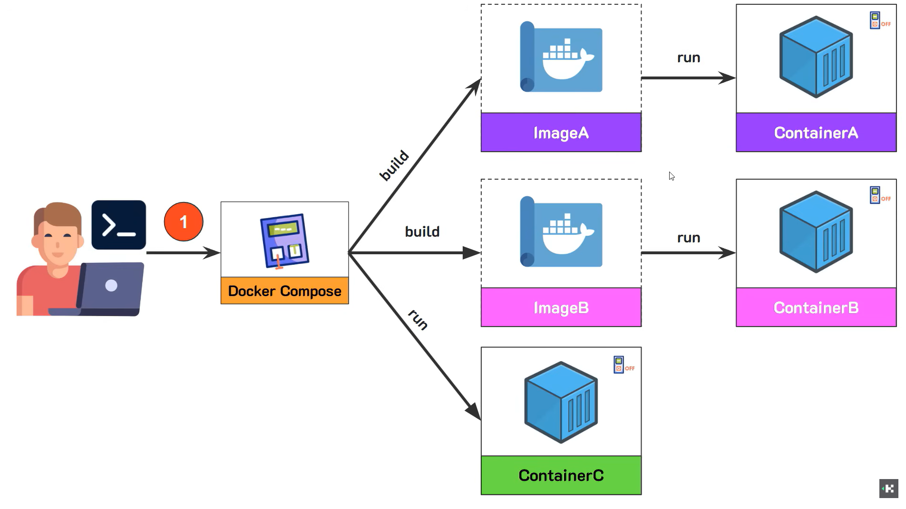
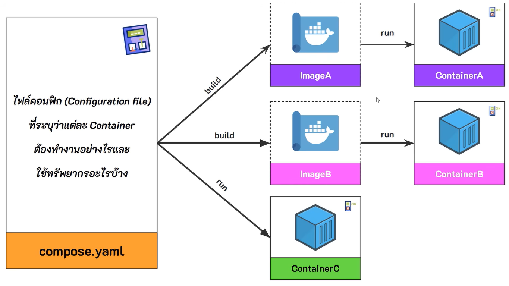
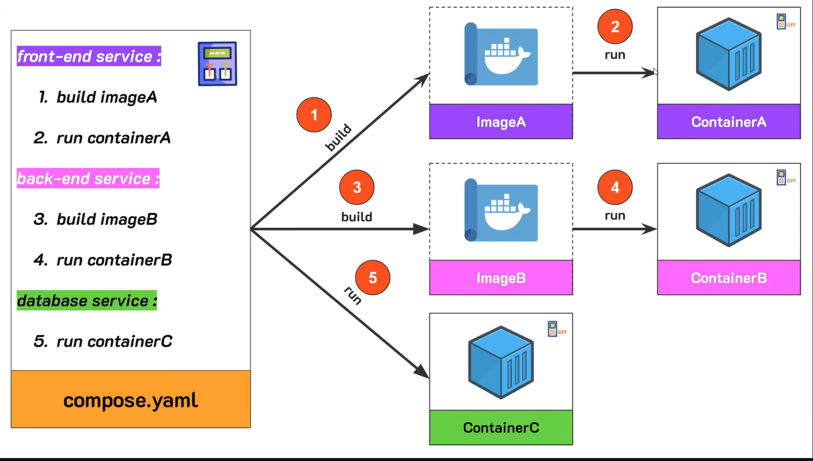
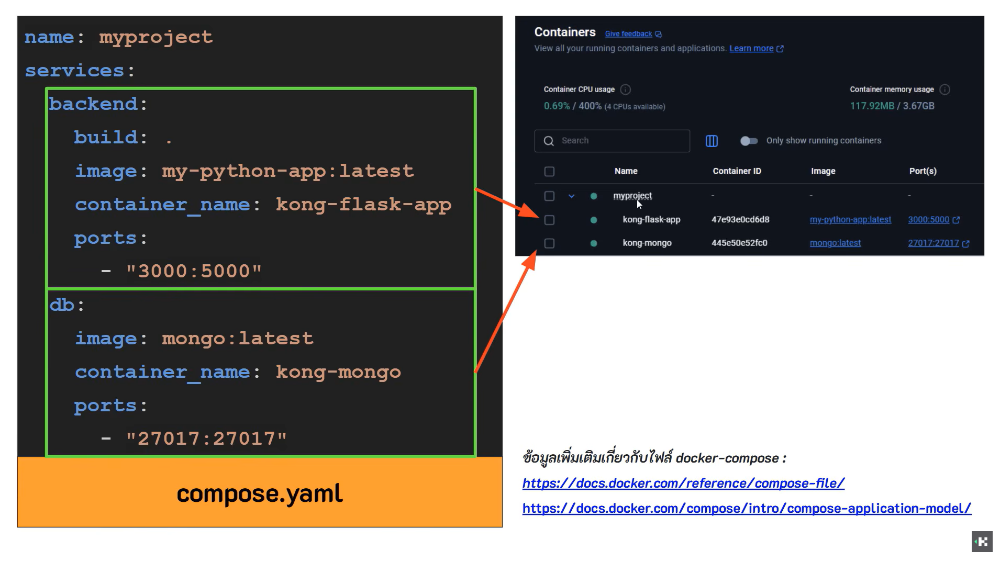

## Docker Compose
ในการทำงานโดยปกติแล้ว ใน 1 web application มักจะถูกแบ่งออกเป็นหลายส่วน เช่น
- frontend
- backend
- database

ซึ่งจากระบบทั้งหมด จะทำงานร่วมกัน ไม่สามารถขาดสิ่งใดสิ่งหนึ่งได้

โดยปกติแล้ว การพัฒนาระบบให้มีประสิทธิภาพ เราจะต้องแบ่งระบบที่มีขนาดใหญ่ออกเป็นส่วนย่อย ๆ (service) เพื่อลดความซับซ้อนของระบบ ทำให้แอพของเรามีโครงสร้างที่ดีและดูแลรักษาง่ายในระยะยาว
เนื่องจาก ปกติแล้วแต่ละ Service ก็จะทำหน้าที่เฉพาะด้านของตัวเองตามที่นักพัฒนาออกแบบไว้อยู่แล้ว เช่น web server, database เป็นต้น

โดยเราจะทำแต่ละ service มาทำเป็น container แยกออกจากกัน

**ตัวอย่าง**

โดยหากใช้วิธีการปกติในการนำแอพพลิเคชันสร้างเป็น image และนำไปสร้างเป็น container จะพบว่ามีหลายขั้นตอนต้องทำ (ต้องทำทีละ service)

*จากรูปมีอยู่ 5 ขั้นตอน*

โดยหากระบบมีขนาดใหญ่มากกว่านี้ ก็จะต้อง build -> run, build -> run แบบนี้ไปเรื่อย ๆ (เหนื่อยแน่นอน)

เราจำเป็นต้องมีตัวควบคุมในการทำงานเปิด/ปิด container
ซึ่งตัวควบคุมนั้นคือ docker compose

## Docker Compose
ใช้สำหรับจัดการหลาย ๆ container พร้อมกันในครั้งเดียว

### ประโยชน์ของ dcoker compose
- ช่วยจัดการ container พร้อมกันได้ทีละหลาย ๆ ตัว
- ช่วยจัดการขั้นตอนต่าง ๆ เพื่อลดความผิดพลาดโดยการใช้งานไฟล์ YAML ในการบันทึกการตั้งค่าทั้งหมด
- ใช้จัดการ network เพื่อเชื่อมต่อกันระหว่าง container ได้ โดยไม่ต้องตั้งค่าเอง รวมถึง volumns สำหรับใช้เก้บข้อมูลถาวร
- ใช้ในการทดสอบระบบได้ทะเงแบบ dev, test, production

ใน docker componse จะกำหนดแผนผังลำดับการทำงานสำหรับสร้างและจัดการ container ต่าง ๆ
โดยสิ่งที่ต้องระบุสำหรับแต่ละ service นั้น จะต้องระบุว่า พวกมันมีขั้นตอนการทำงานอย่างไร เช่น
- images ที่ใช้ชื่อว่าอะไร เป็นเวอร์ชันอะไร
- container ที่่จะรันมีกี่รายการ
- port mapping หมายเลขอะไร

**ตัวอย่างการทำงานด้านใน compose.yaml**

### ตัวอย่างการสร้าง service ด้วย docker compose
    services:
        backend:
            build: .
            image: shopping-api:latest
            container_name: shopping-main-api
            ports:
                - "3000:5000"
        db:
            image: mysql:latest
            container_name: shipping-main-db
            ports: 
                - "3306:3306"

### อธิบายส่วนประกอบ
- ชื่อ service: backend
- build: ตำแหน่ง dockerfile สำหรับใช้ build
- image: นำ custom image ที่ build ก่อนหน้ามาใช้งานพร้อมกำหนดชื่อและ tag image (optional)
- container_name: กำหนดชื่อของ container
- ports: จับคู่ port ในเครื่องจริงเข้ากับ container

## ชุดคำสั่งสำหรับ docker compose
### docker compose up
    รันทุก container พร้อมกัน
### docker compose up -d
    รันทุก container พร้อมกันในโหมด backgroud
### docker compose up --build
    รันทุก container พร้อมกัน โดยก่อนรัน container จะทำการสร้าง images ของแต่ละ Service ขึ้นมาใหม่ก่อน
    โดยจะใช้เมื่อมี่การอัพเดทหรือเปลี่ยนแปลงการทำงานของโค้ดของเรา 
    จะทำให้ใน container เป็นโค้ดเวอร์ชันล่าสุด
### docker compose down
    หยุดการทำงานและลบ container และอื่น ๆ ที่ docker compose สร้างขึ้น เช่น network
### docker compose stop
    หยุดรัน container ที่กำลังทำงานอยู่
### docker compose start
    รันทุก container ในแต่ละ service ที่เราหยุดการทำงานไว้
### docker compose restart
    เริ่มต้นการทำงาน container ใหม่ทั้งหมดหรือเฉพาะที่ระบุ
### docker compose ps
    ดูสถานะของ container ที่ถูกจัดการโดย docker compose