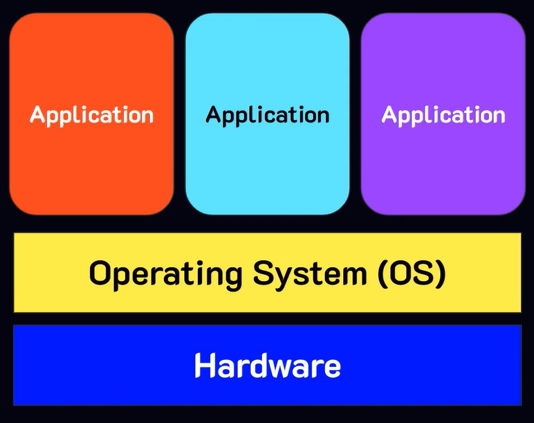
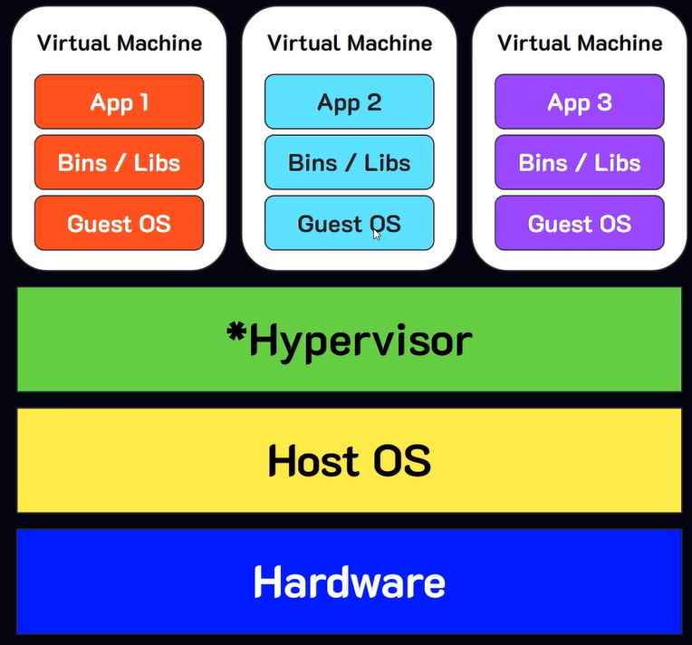
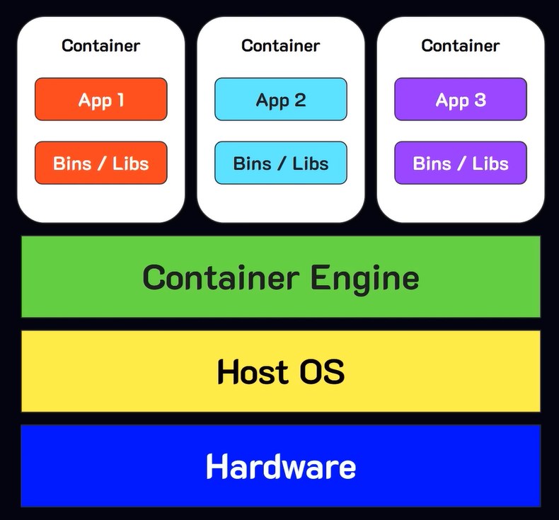
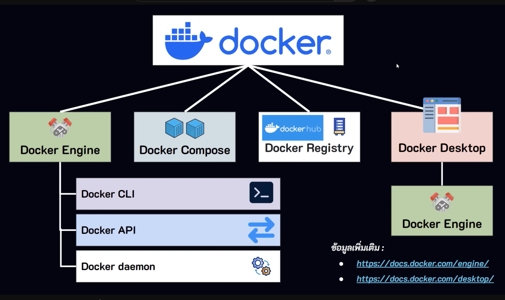
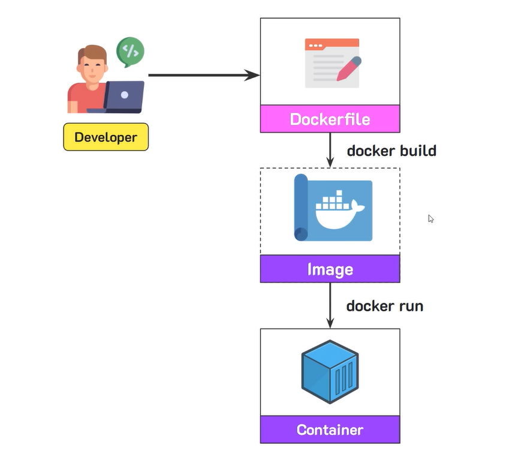

# Summary Docker Lecture

## การจัดการ deployment แต่ละยุค
### Tradional Deployment
เป็นการติดตั้งระบบลงบนเครื่องจริง (Phtsical Server) เช่น การลง PHP, MySQL โดยตรง

**ข้อเสีย**
- หากต้องการให้บริการหลายแอพพลิเคชัน โดยแต่ละแอพใช้ runtime ตัวเดียวกัน **แต่เวอร์ชันต่างกัน** จะทำให้ไม่สามารถทำงานร่วนกันได้ เช่น
    - application a ใช้ dotnet 8
    - application b ใช้ dotnet 2.1
- การอัพเดทระบบทำได้ยาก เพราะการอัพเดทระบบเพียงตัวเดียว จะส่งผลกระทบกับทุกระบบที่อยู่บนเครื่องเดียวกัน
- ขยายระบบยาก
- ความปลอดภััยต่ำ

### Virtualized Deployment
มีการคิดค้น Software Hypervisor ขึ้นมา ซึ่งทำให้สามารถสร้าง virtual machine ขึ้นมาไว้บน physical machine ได้ ทำให้่สามารถรันระบบได้หลายตัวด้วยสภาพแวดล้อมที่แตกต่างกันได้ เช่น dotnet 8 กับ dotnet 2.1 สามารถทำงานบน physical machine เดียวกันได้ เพราะว่าแต่ละตัวรันอยู่ที่คนละ virtual machine

**ข้อเสีย**
- ใช้ทรัพยากรณ์เยอะ
- ทำงานช้ากว่าเครื่องจริง
- มีความซับซ้อนในการบริหารจัดการ VM หลายเครื่อง
- มีค่าใช้จ่ายสูง

### Container Deployment
เป็นการนำแอพพลิเคชันแลพทรัพยากรณ์ที่เกี่ยวข้องกับแอพ (code, library, config) มาแพ็ครวมกันและเก็บไว้ในสิ่งที่เรียกว่า container ซึ่งทำให้สามารถทำแอพพลิเคชันไปไว้ที่ไหนก็ได้ แม้สภาพแวดล้อมจะต่างกัน

*แนวคิดคล้ายกับ VM แต่ตัด OS ออก ทำให้ระบบสามารถทำงานได้ไวขึ้น*

โดยแต่ละ container จะทำงานแยกออกจากกัน การเปลี่ยนแปรงใน container หนึ่งจะไม่ส่งผลกับ container อื่น ๆ

## Docker
เป็นแพลทฟอร์มใช้จัดการระบบในรูปแบบ container โดวยมีส่วนประกอบต่าง ๆ ดังนี้
1. **Docker CLI** เครื่องมือสั่งงาน docker engine
2. **Docker Engine** เครื่องมือจัดการ container
3. **Docker Compose** เครื่องมือจัดการหลาย ๆ container พร้อมกัน
4. **Docker Desktop** desktop app สำหรับจัดการ container
5. **Docker Registry** เป็นคลังส่วนกลาง จัดเก็บ images

แผนผัง docker plateform

### ขั้นตอนการใช้งาน docker

1. สร้าง dockerfile ขึ้นมา เพื่อกำหนดว่า ระบบของเราต้องการอะไรบ้าง
2. นำ dockerfile สร้างเป็น image
3. นำ image มาสร้างเป็น container 

### image
เป็นแม่แบบของ container โดย container จะสามารถทำงานอะไรได้ ขึ้นอยู่กับว่า image ถูกเซ็ทค่าไว้อย่างไรบ้าง (เซ็ทค่า image ด้วย dockerfile)

### container
เป็นกล่องที่มีแอพพลิเคชันและทรัพยากรณ์ที่จำเป็นสำหรับการทำงานของแอพ โดย container จะมีอะไรบ้าง ขึ้นอยู่กับที่ image กำหนด

**1 image สามารถนำไปสร้างได้หลาย container**

## Dockerfile
ใช้สำหรับระบุขั้นตอนการสร้าง image ว่าใน image ที่เราต้องการ จำเป็นต้องมีอะไรบ้าง
โดยชุดคำสั่งใน dockerfile ประกอบด้วย
1. **FROM** เป็นการกำหนด base image ที่เรานำมาใช้ (เช่น container นี้เราจะใช้ react เราก็จะนำ base image ของ nodejs มาใช้)
2. **WORKING** กำหนดโฟลเดอร์ทำงานของ container
3. **COPY** คัดลอกไฟล์จากเครื่องของเรา (local) ไปยัง container
4. **RUN** รันคำสั่ง comman ต่าง ๆ ระหว่างการ build
5. **EXPOSE** ระบุ port ที่ container นี้จะใช้ในการสื่อสารกับคนภายนอก
6. **CMD** รันคำสั่ง comman ต่าง ๆ ตอน container กำลังทำงาน

**ตัวอย่างคำสั่ง**
    
    FROM python:3.13
    WORKDIR /bright/app
    COPY requirements.txt .
    RUN pip install --no-cache-dir-r requirments.txt
    COPY . .
    EXPOSE 5000
    CMD ["python", "app.py"]

## Port Mapping
เป็นการตั้งค่าให้ physical machine สามารถเรียกใช้งานระบบที่อยู่ใน virtual machine ได้ (หากยังไม่ตั้งค่า physical จะไม่สามารถเข้าถึงระบบที่อยู่ใน virtual)

## Docker Ignore
ใช้สำหรับระบุไฟล์หรือโฟลเดอร์ที่ไม่ต้องการนำเข้าไปใน container

## Docker Compose
ใช้สำหรับจัดการ container พร้อมกันหลายตัว

## ชุดคำสั่ง
### docker
- **docker --version** ตรวจสอบเวอร์ชันของ docker
- **docker info** แสดงรายละเอียดของ docker ที่ติดตั้งอยู่
- **docker system df** แสดงข้อมูลการใวช้พื้นที่ disk ของ docker
- **docker --help** แสดงชุดคำสั่งที่มีทั้งหมด

### images
- **docker images** แสดง images ที่มีทั้งหมดบนเครื่อง
- **docker pull (image-name)** ดึง image จาก docker hub ลงมาใส่เครื่องเรา
    - **(image-name):(version)** ระบุชื่อของ image พร้อม version
- **docker inspect (image-name)** ดูรายละเอียดของ image
- **docker rmi (image-id)** ลบ image ตาม id ที่ระบุ
    - **(image-id):(version)** ระบุไอดีของ image พร้อม version
- **docker image prune** ลบ image ที่ไม่ได้ใช้ (ไม่ได้นำมาสร้าง container)

### container
- **docker run (image-name)** นำ image มาสร้างเป็น container
    - **-d** (deteched) รัน container แบบ background
    - **-it** รัน container โดยที container จะรอรับคำสั่งจาก power shell
    - **--name** ระบุชื่อที่ต้องการตั้งให้กับ container
    - **--rm** สั่งให้เมื่อ container หยุดทำงาน ให้ลบ container ออกทันที
    - **-p** ระบุ port ระหว่าง physical machine กับ virtual machine
- **docker ps** แสดง container ที่กำลังทำงาน
    - **-a** แสดง container ทั้งหมด (รวมที่ไม่ทำงานด้วย)
- **docker container prune** ลบ container ที่ไม่ได้ใช้งานออกทั้งหมด
- **docker start (container-id)** สั่งให้ container ทำงาน
- **docker stop (container-id)** สั่งให้ container หยุดทำงาน
- **docker pause (container-id)** สั่งให้ container หยุดทำงานชั่วคราว
- **docker unpuse (container-id)** สั่งให้ container ที่หยุดทำงาน กลับมาทำงานต่อ
- **docker rm (container-id)** ลบ container
    - **-f** สั่งให้ลบ container แม้จะทำงานอยู่ก็ตาม

### dockerfile
- **docker build** สั่งให้นำ dockerfile ไปสร้างเป็น image

### push image
- **docker tag (source-image):(version) (target-image):(version)** ใช้สำหรับสร้างชื่อใหม่และเลขเวอร์ชันให้กับ image
- **docker push (username)/(repository):(version)** ใช้สำหรับนำ image ที่อยู่บนเครื่องเราขึ้นไปที่ docker hub